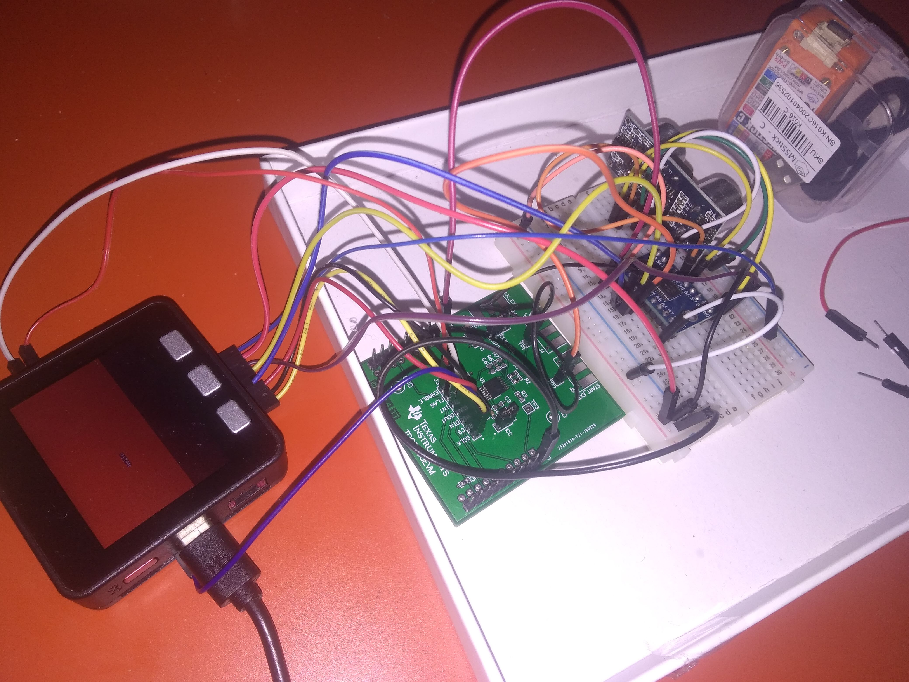

# Trying to have TDC7200 and HCSR04 run togethers.

## Hardware

* tdc7200evm
* hcsr04
* breadboard and wires/jumpers
* m5stack
* 5V-3.3V bidirectional level shifter (eg HW-221 )

## Present

* main: main arduino code
* backup of the libs
* TDCtests= auto test (without HCSR04)

## Libs

Replace the cpp and h files from your TDC7200 folder [with those here](https://github.com/kelu124/TDC7k2_HCSr04/tree/master/TDC7200_changed)

## Ongoing issues

Get good reading from the TDC7200 :p
```
	// calCount scaled by 2^shift
	const int64_t calCount = ( int64_t(calibration2-calibration1) << shift ) / int64_t(m_cal2Periods - 1);
	// normLsb scaled by 2^shift, divided by calcount (scaled by 2^shift),
	// so multiply by 2^(2*shift) to compensate for divider in calCount
	m_normLsb  = (uint64_t(m_clkPeriodPs) << (2*shift)) / calCount;
```

Getting a div/0 error with calCount ( `CalibA == CalibB == 0 ?`  ).

* `TDC7200_Test_m5`: shows correct CalibA / CalibB
* `main code`: shows O on both.

Weird.

## Arduino Setup


## Physical connections

Just need to but a birectional level translator between HCSR04 (5V) and the rest of the world (3.3V). It is controlled through OE by Pin3 of M5STACK. Allows to switch between `TDC7200_Test_m5` and `main code` without changing the connections.

### Setup 


